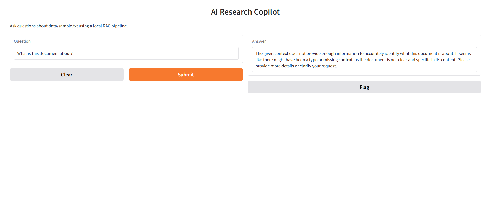

# DocuMind — AI Document Assistant with RAG


DocuMind is an AI-powered document assistant that leverages Retrieval-Augmented Generation (RAG) to deliver accurate, context-aware answers from local documents.

---

## Demo



Users can upload or load documents and interact with them through a chat interface powered by a local LLM.

---

## Key Highlights

- Combines semantic retrieval + LLM generation (RAG)
- Reduces hallucination by grounding answers in document context
- Fully local pipeline (no external API required)
- Interactive web UI with real-time Q&A

---

## How It Works

```
User Question
     ↓
Embedding
     ↓
FAISS Retrieval
     ↓
Relevant Context
     ↓
Prompt Construction
     ↓
LLM Generation
     ↓
Final Answer
```

---

## Features

- Document ingestion (.txt, .md, .pdf)
- Context-aware text chunking
- Sentence-transformer embeddings
- FAISS vector similarity search
- Local LLM inference (Qwen)
- Gradio-based web interface

---

## Tech Stack

- Python
- PyTorch
- Hugging Face Transformers
- Sentence Transformers
- FAISS
- Gradio

---

## Project Structure

```
DocuMind/
├── data/
├── src/
├── gradio_app.py
├── requirements.txt
├── screenshot.png
└── README.md
```

---

## Installation

```bash
git clone https://github.com/luozhe2019/DocuMind.git
cd DocuMind
pip install -r requirements.txt
```

---

## Usage

```bash
python gradio_app.py
```

Open in browser:

```
http://127.0.0.1:7860
```

---

## Example

**Question**
```
What is this document about?
```

**Answer**
```
The document explains large language models and how RAG improves accuracy by combining retrieval and generation.
```

---

## Limitations

- Single-document support
- No conversation memory
- Performance depends on local hardware

---

## Future Work

- Multi-document retrieval
- PDF upload via UI
- Chat history memory
- Deployment (Docker / Cloud)

---

## License

MIT License

---

## Author

Luo Zhe  
https://github.com/luozhe2019